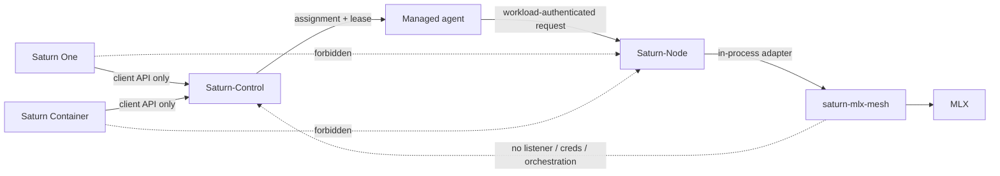
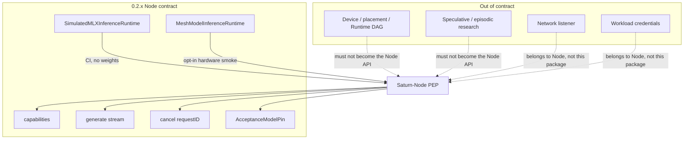
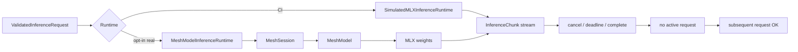
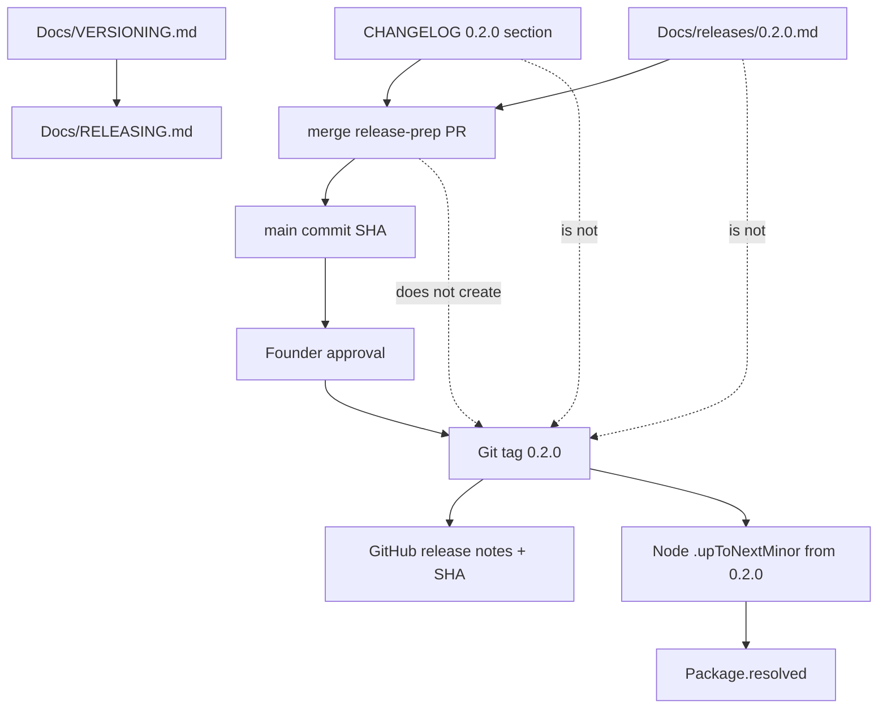
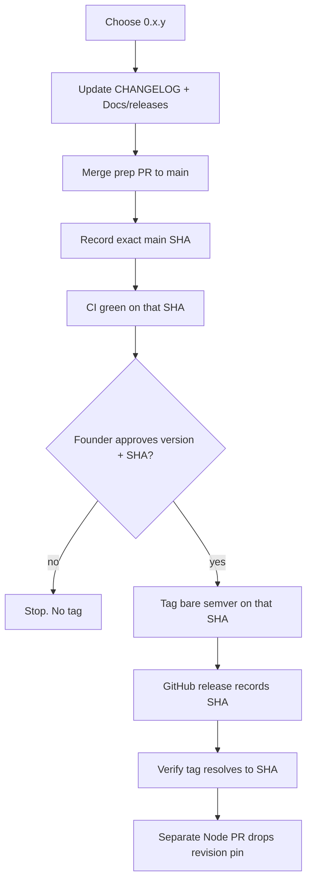
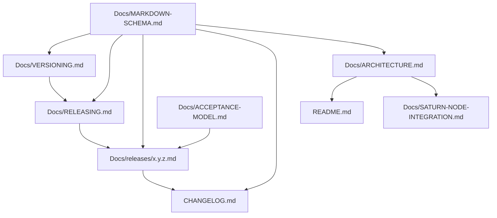

# Architecture

**Type:** architecture
**Status:** binding-after-merge for the `0.2.x` contract diagrams
**Authority:** diagrams describe the library boundary; they do not publish a tag or make Node operational
**Schema:** Docs/MARKDOWN-SCHEMA.md

These flowcharts are the architecture views for saturn-mlx-mesh. Research graph work may exist in the tree and is out of the `0.2.x` Node contract.

## Saturn execution plane

Frontends never call this package. Node loads it in-process.

## Package firewall

## In-process inference path

Default Saturn-Node composition stays fail-closed and does not construct `MeshModelInferenceRuntime`.

## Version identity

## Release procedure

## Doc architecture

