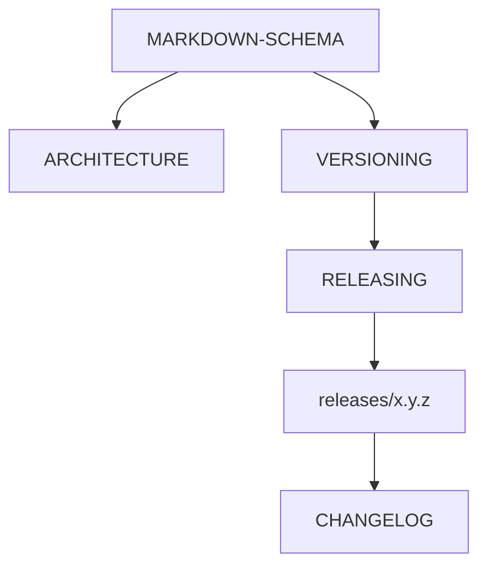

# Markdown schema (version and release docs)

**Type:** schema
**Status:** binding for files in this folder that declare a version or release
**Authority:** does not publish a tag; does not close hardware or Node issues

This file is the schema for saturn-mlx-mesh markdown that talks about versions. If a file disagrees with this schema, the file is wrong.

## File map

| Path | Type | Role |
|------|------|------|
| `README.md` | overview | Product boundary and how to build. Not a release. |
| `CHANGELOG.md` | changelog | Keep a Changelog. Dated sections are history, not tags. |
| `Docs/ARCHITECTURE.md` | architecture | Mermaid flowcharts for plane, firewall, path, version identity, release. |
| `Docs/VERSIONING.md` | versioning-policy | Compatibility contract. What `0.x.y` means. |
| `Docs/RELEASING.md` | release-procedure | How a tag is created. Merge does not tag. |
| `Docs/releases/<x.y.z>.md` | release-record | Prep notes for one intended version. Not the tag. |
| `Docs/MARKDOWN-SCHEMA.md` | schema | This file. |
| `Docs/SATURN-NODE-INTEGRATION.md` | adapter-contract | Library surface Node may call. |
| `Docs/ACCEPTANCE-MODEL.md` | acceptance-pin | Model identity and hardware evidence rules. |
| `Docs/mesh-llm-mlx-extension.md` | research-note | Not part of the `0.2.x` Node contract. |

Do not add a second `docs/` directory. All package docs live under `Docs/`.



## Required header

Every version/release markdown file starts with:

```text
# <Title>

**Type:** <one type from the file map>
**Status:** <one line: draft | binding-after-merge | published-tag-pending | published>
**Authority:** <what this file must not be mistaken for>
**Schema:** Docs/MARKDOWN-SCHEMA.md
```

`CHANGELOG.md` is exempt from the four-line header. It uses Keep a Changelog section titles only.

An optional one-line pointer to `ARCHITECTURE.md` may sit immediately after the header.

## Mermaid

Architecture diagrams use GitHub-flavored `mermaid` `flowchart` blocks (`LR`, `TB`, or `TD`). They illustrate boundaries. They do not authorize tags, listeners, or deploys.

Canonical diagrams live in `Docs/ARCHITECTURE.md`. Other files may repeat a single focused chart; they must not invent a second runtime path.

## Type schemas

### `architecture` (`Docs/ARCHITECTURE.md`)

Required sections, in order:

1. Saturn execution plane
2. Package firewall
3. In-process inference path
4. Version identity
5. Release procedure
6. Doc architecture

Each section contains one `flowchart`.

### `versioning-policy` (`Docs/VERSIONING.md`)

Required sections, in order:

1. Principle
2. Current release line
3. Before the first stable release
4. After `1.0.0`
5. Release provenance
6. Stable release eligibility

Must state:

- first *published* tag (`0.2.0`)
- that changelog `0.1.0` is not a tag on current `main`
- Node consumer form `.upToNextMinor(from: "0.2.0")`
- `0.2.x` = adapter + pin + smoke; research graph is out of contract

Must not state that a changelog section or this PR is a published release.

### `release-procedure` (`Docs/RELEASING.md`)

Required sections, in order:

1. Release authority
2. License and publication
3. Preconditions
4. Release procedure (numbered; merge is not a tag)
5. Consumer contract
6. Rollback and correction

Must state: no `v` prefix on tags; never retarget; founder approval of version + exact SHA; Node pin-switch is a separate PR after the tag exists.

### `release-record` (`Docs/releases/<x.y.z>.md`)

Filename is the bare semver, no `v`. Required sections, in order:

1. Intent
2. Product / library boundary
3. Adapter contract
4. Toolchain
5. License
6. Hardware provenance
7. Known limitations
8. Saturn-Node migration

Must include the sentence that this file is not a published tag. Hardware SHA, if cited, is provenance, not a new gate.

### `changelog` (`CHANGELOG.md`)

```text
# Changelog

<one paragraph pointing at VERSIONING.md and RELEASING.md>

## [Unreleased]

- work not in any dated section

## [<x.y.z>] - YYYY-MM-DD

<what that version contains>

See `Docs/releases/<x.y.z>.md`.
```

Rules:

- Newest dated section immediately under `Unreleased`.
- A dated section may exist before the Git tag. The section is not the tag.
- Do not put research-graph essays in a published-line section.
- Do not retitle `0.1.0` as Apache-2.0. That section is proprietary history.

## Identity mapping (do not collapse)

```text
changelog section  != Git tag
Docs/releases/*.md != GitHub release
Git tag            == immutable release identity
commit SHA         == provenance
Package.resolved   == what Node actually builds
```

## Forbidden claims in any of these files

- Saturn-Node is operational
- this package opens a listener or verifies credentials
- `0.2.0` closes mesh#1 by itself
- 32B is the primary pin
- merge of a docs PR publishes a tag
- current `main` may be tagged `0.1.0`

## PR #15 check

| File | Type | Header | Sections |
|------|------|--------|----------|
| `Docs/ARCHITECTURE.md` | architecture | required | six flowchart sections |
| `Docs/VERSIONING.md` | versioning-policy | required | six named sections |
| `Docs/RELEASING.md` | release-procedure | required | six named sections |
| `Docs/releases/0.2.0.md` | release-record | required | eight named sections |
| `CHANGELOG.md` | changelog | exempt | Unreleased, 0.2.0, 0.1.0 |
| `Docs/MARKDOWN-SCHEMA.md` | schema | this file | file map + type schemas |
