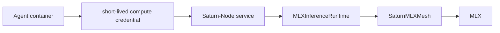
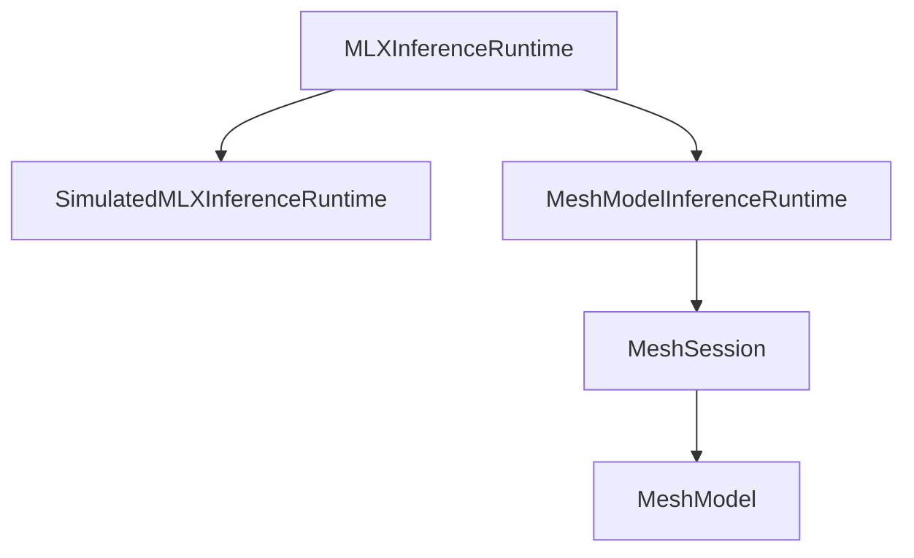

# Saturn-Node Integration Boundary

**Status:** Stable library adapter surface defined; real MLX path available; service implementation lives in `saturn-node`

Architecture views: [`ARCHITECTURE.md`](ARCHITECTURE.md).

## Toolchain and platform contract

`saturn-mlx-mesh` uses Swift tools **6.3** with deployment floors of **macOS 26** and **iOS 26**. The package baseline intentionally matches the current Saturn-Node macOS 26 toolchain so the Node does not consume a dependency compiled against an older platform contract.

Normal CI remains deterministic and weight-free. Real model execution is an explicit Apple Silicon hardware gate described in `ACCEPTANCE-MODEL.md`.

## Decision

`saturn-mlx-mesh` is an in-process MLX inference library. A separate `saturn-node` service owns workload authentication, network transport, model allowlisting, quotas, service lifecycle, and operational recovery.



```text
Agent container
    -> private TLS + short-lived compute credential
    -> Saturn-Node service
    -> SaturnMLXMesh library (MLXInferenceRuntime adapter)
    -> MLX
```

Saturn-Control issues the compute assignment and credential. The agent container does not select arbitrary models or load model weights directly.

## Stable service-to-library adapter

The Saturn-Node service depends on this narrow library protocol (see `SaturnNodeAdapter.swift`):

```swift
public protocol MLXInferenceRuntime: Sendable {
    func capabilities() async throws -> InferenceCapabilities

    func generate(
        _ request: ValidatedInferenceRequest
    ) -> AsyncThrowingStream<InferenceChunk, Error>

    func cancel(requestID: InferenceRequestID) async
}
```

### Implementations

| Type | Purpose |
|------|--------|
| `SimulatedMLXInferenceRuntime` | Deterministic CI / unit tests. **No weights.** |
| `MeshModelInferenceRuntime` | **Real MLX.** Loads `MeshModel` via `MeshSession`, streams tokens, and provides cooperative cancellation. |



```swift
// Real path (Apple Silicon, downloads/caches weights):
let runtime = try await MeshModelInferenceRuntime.loadPrimary()
// model id defaults to AcceptanceModelPin.primaryModelID
```

Saturn-Node default composition must remain fail-closed. Select `MeshModelInferenceRuntime` only under explicit opt-in (local smoke, Founder-gated hardware acceptance). Never construct it from ordinary CI unit tests.

Supporting types: `InferenceRequestID`, `ValidatedInferenceRequest`, `InferenceCapabilities`, `InferenceChunk`, `MeshInferenceError`, `AdapterTelemetry`.

### Acceptance model pin

- `AcceptanceModelPin.primaryModelID` → `mlx-community/Qwen3-8B-4bit`
- Procedure: [`ACCEPTANCE-MODEL.md`](ACCEPTANCE-MODEL.md)

The package hardware executable now tests the same `MLXInferenceRuntime` implementation used by Saturn-Node:

```sh
swift run SaturnMLXMeshSmoke
swift run SaturnMLXMeshSmoke --cancel-recovery
```

The first command verifies real load + streamed completion and reports timing metadata. The second additionally requires cancellation and a subsequent successful request. Generated content is suppressed by default.

## Compute credential boundary

Saturn-Node validates a short-lived credential before calling the library. The library does not parse credentials, open listeners, or decide authorization.

## Cancellation

Cancellation must propagate to the library `cancel(requestID:)` and stop active generation. `MeshModel` token loops respect `Task.isCancelled`. Exactly one terminal chunk is required, request-owned active state must be cleared, and a subsequent request must succeed.

The mesh hardware smoke can prove those library-level properties. Managed service restart, client disconnect propagation, authenticated transport, and resource governance remain Saturn-Node acceptance gates.

## Telemetry

`AdapterTelemetryRecord` remains metadata-only. Standard telemetry and acceptance artifacts must not contain prompt or generated-response bodies.

## Explicit non-goals

- network server implementation;
- workload token parsing;
- Apple Container integration;
- agent orchestration;
- claiming mesh#1 closed without recorded hardware evidence.
