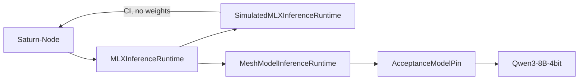

# saturn-mlx-mesh 0.2.0

**Type:** release-record
**Status:** published-tag-pending
**Authority:** release-prep notes only; this file is not a Git tag or GitHub release
**Schema:** Docs/MARKDOWN-SCHEMA.md

Architecture views: [`../ARCHITECTURE.md`](../ARCHITECTURE.md).

First published semantic release. First Apache-2.0 tagged release.

This file is the release-prep record. The immutable tag-to-SHA mapping is written in the GitHub release after founder approval. Do not treat this document as a published tag.

## Intent

Give Saturn-Node a versioned SwiftPM dependency for the stable in-process MLX adapter, replacing the temporary revision pin.



## Product / library boundary

- In-process MLX inference library only.
- No listener, no workload credentials, no Saturn-Control types.
- Graph, placement, speculative, and episodic-memory research is present in the tree and is **not** part of the 0.2.x Node contract.

## Adapter contract

- `MLXInferenceRuntime`
- `MeshModelInferenceRuntime` (real MLX, opt-in)
- `SimulatedMLXInferenceRuntime` (CI, no weights)
- `AcceptanceModelPin.primaryModelID` = `mlx-community/Qwen3-8B-4bit`
- `SaturnMLXMeshSmoke` hardware executable

## Toolchain

- Swift tools 6.3
- macOS 26 / iOS 26
- CI Xcode 26.6

## License

Apache License 2.0 for current `main` first-party materials. Changelog section `0.1.0` stays proprietary history and must not be tagged on this tree.

## Hardware provenance

Sustained hardware evidence for the pinned 8B-4bit path was recorded against SHA `8ce1d6f6d6f5304f526019a5b5bcbf3f2b2f783e`. `0.2.0` includes that surface plus Apache-2.0 relicensing. Relicensing is not a new hardware campaign.

## Known limitations

- Not a service. Not operational.
- 32B is not the primary pin.
- Floating SwiftPM ranges for `mlx-swift-lm` / Hugging Face remain development bounds; Node acceptance records resolved revisions via `Package.resolved`.
- Publishing `0.2.0` does not close saturn-mlx-mesh#1 on GitHub until the issue body is updated.

## Saturn-Node migration

After the `0.2.0` tag exists:

```swift
.package(
    url: "https://github.com/EvoCortexAI/saturn-mlx-mesh.git",
    .upToNextMinor(from: "0.2.0")
)
```

Commit `Package.resolved`. Keep the current revision pin until that tag is published.
