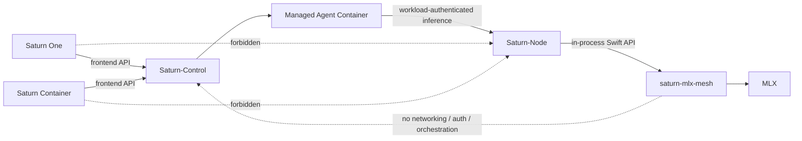
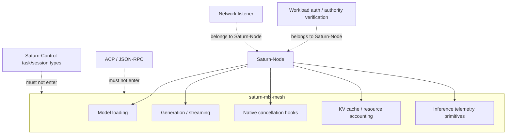
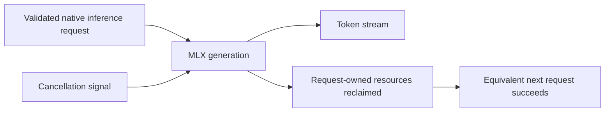

# saturn-mlx-mesh

**MLX-native inference library for Apple Silicon**

Part of EvoIntelligenceFabric and loaded inside Saturn-Node.

This package is not Saturn-Node itself. It is the in-process MLX execution library used by the private Saturn-Node inference service.

## Toolchain baseline

- Swift tools **6.3**
- CI Xcode **26.6**
- deployment floors: **macOS 26** and **iOS 26**
- real-hardware acceptance: explicit Apple Silicon smoke only; normal CI remains weight-free

The platform floor is intentionally aligned with Saturn-Node. Raising the manifest baseline does not itself constitute real-runtime acceptance; target hardware evidence is tracked separately.

## Canonical runtime path



Frontends call Saturn-Control only. Agent containers call their assigned Saturn-Node with bounded workload-scoped compute authority issued by Saturn-Control.

## Package firewall



The library must remain protocol-agnostic. It must not import ACP, JSON-RPC, Saturn-Control task/session modules, frontend types, or EvoEthics policy administration.

## This repository owns

- MLX model loading and inference primitives;
- token streaming;
- native cancellation hooks;
- KV-cache behavior and resource-accounting hooks needed for cancellation proof;
- placement and graph research;
- inference telemetry primitives;
- deterministic simulation and hardware smoke support.

It does not own:

- Apple Container execution or lifecycle;
- Saturn-Control orchestration;
- agent logic or tools;
- workload credential issuance or verification;
- authority/receipt verification;
- a network listener or public API;
- service installation, launchd lifecycle, health endpoints, or rollback;
- user authentication;
- frontend behavior.

Those service responsibilities belong in Saturn-Node. Container execution belongs to Saturn-Control's Container Runner.

## MVP priority - one reliable inference path



The immediate priority is one repeatable, real-hardware inference path on Saturn-Node-01.

### Acceptance model pin (KF primary)

| Field | Value |
|-------|--------|
| Primary model | `mlx-community/Qwen3-8B-4bit` |
| Code | `AcceptanceModelPin.primaryModelID` |
| Doc | [`Docs/ACCEPTANCE-MODEL.md`](Docs/ACCEPTANCE-MODEL.md) |

This is the **selected** primary model identity for mesh#1 and the Keiretsu Forum single-path demo. It is **not** automatic closure of hardware acceptance. Closing mesh#1 still requires recorded load/stream/cancel/restart evidence on target Apple Silicon.

**Out of primary path before that gate:** Qwen 32B-class models (optional second-slide only), multi-model product support, distributed graph expansion.

### Real-hardware smoke

The hardware executable now exercises `MeshModelInferenceRuntime`, the same library-side runtime contract consumed by Saturn-Node, rather than bypassing it through a direct low-level model call.

Baseline real load + streamed completion:

```sh
swift run SaturnMLXMeshSmoke
```

Add explicit cancellation and subsequent-request recovery on the same loaded runtime:

```sh
swift run SaturnMLXMeshSmoke --cancel-recovery
```

Default output is metadata-only: model identity, load duration, time to first non-empty delta, generated delta count, generation duration, finish reason, cancellation/recovery status, and overall pass/fail. Prompt and generated response bodies are suppressed unless `--show-content` is explicitly requested for local debugging.

Before recording acceptance evidence, also capture the exact repository/toolchain/dependency resolution from the target host:

```sh
git rev-parse HEAD
swift --version
xcodebuild -version
sw_vers
uname -m
swift package show-dependencies --format json
```

See `Docs/ACCEPTANCE-MODEL.md` for the complete evidence contract. A library smoke does not prove Saturn-Node authentication, transport, service restart, or deployment readiness.

### Acceptance sequence

1. Pin one MLX runtime revision and model manifest after checking target hardware.
2. Complete a clean-state model-load and streamed-generation smoke.
3. Verify token streaming, explicit cancellation, timeout, and disconnect recovery.
4. Verify request-owned resource reclamation after cancellation.
5. Verify managed Saturn-Node restart followed by successful inference.
6. Record model, runtime, node, timing, token-count, resource, and outcome metadata without prompt or response content.
7. Repeat a fixed acceptance set before expanding graph, placement, speculative, or episodic-memory behavior.

### Deferred

- multi-device execution;
- automatic multi-node routing;
- new Runtime DAG expansion;
- additional scheduler complexity;
- speculative-decoding research beyond the selected path;
- broad episodic-memory and hybrid RAG integration;
- service authentication or orchestration code in this package;
- Apple Container integration.

## Public library API

```swift
let mesh = MeshSession(
    controlPlane: .local,
    policy: .appleSiliconBalanced
)

let model = try await mesh.loadModel(
    id: AcceptanceModelPin.primaryModelID,
    role: .primary
)

let stream = try await model.generate(
    prompt: "Explain Saturn mesh inference.",
    maxTokens: 512,
    temperature: 0.7,
    speculativeGamma: 4
)

for try await token in stream {
    print(token.text, terminator: "")
}
```

This is an in-process library surface. Production model selection, workload authentication, quotas, request validation, and network streaming belong to Saturn-Node. Policy and compute assignment belong to Saturn-Control.

## Key components

- `MeshSession` - actor factory, local control-plane selection, and placement policy
- `MeshModel` - actor-isolated generation, KV-cache reuse, and telemetry hooks
- `MeshModelInferenceRuntime` - real MLX implementation of the stable Saturn-Node library adapter contract
- `SimulatedMLXInferenceRuntime` - deterministic CI/unit-test implementation with no model downloads
- `PlacementPolicy` and `AppleSiliconBalanced` - execution-unit decisions with explicit cost concepts
- `MeshTelemetry` - model-load and generation records
- graph foundation types for devices, execution units, model components, weights, and residency
- `KVCacheManager`, `LayerBudgetAllocator`, and `EpisodeKVCache`
- `AcceptanceModelPin` - single primary model identity for acceptance / KF

The library's `controlPlane: .local` value is internal inference-library configuration. It does not mean Saturn-Control or Apple Container orchestration lives in this package.

## Current technical state

The technical foundation includes actor-based model/session surfaces, MLX Swift LM and Hugging Face integrations, cache/research foundations, streaming/cancellation-oriented structure, telemetry, deterministic simulation, a real `MeshModelInferenceRuntime`, and opt-in Apple Silicon hardware acceptance support.

A feature in this package is not automatically a supported Saturn product capability.

## Build and test

With Xcode 26.6 / Swift 6.3 selected:

```sh
swift package dump-package >/dev/null
swift build
swift test
```

Real MLX execution requires compatible Apple Silicon and is intentionally excluded from ordinary CI. Run the opt-in hardware commands manually on the selected target host:

```sh
swift run SaturnMLXMeshSmoke
swift run SaturnMLXMeshSmoke --cancel-recovery
```

The smoke alone is insufficient. Saturn-Node must also prove workload authentication, limits, streaming, cancellation, client-disconnect behavior, restart, and end-to-end managed-agent behavior.

## Dependencies

- `mlx-swift-lm`
- `swift-huggingface`
- `swift-transformers`

The manifest uses reviewed lower-bound compatibility ranges for development. The managed Saturn-Node runtime must pin and record the exact resolved dependency revisions used for hardware acceptance and deployment. A floating SwiftPM range is not a production manifest.

## Saturn-Node integration

See [`Docs/SATURN-NODE-INTEGRATION.md`](Docs/SATURN-NODE-INTEGRATION.md) and [`Docs/ACCEPTANCE-MODEL.md`](Docs/ACCEPTANCE-MODEL.md).

Saturn-Node wraps this library behind a private, workload-authenticated service boundary. The library never parses workload credentials, opens a network listener, decides user authorization/policy, or executes agent tools.

## Relationship to Saturn

- **User client:** Saturn One
- **Advanced operator:** Saturn Container
- **Control plane and container execution authority:** Saturn-Control
- **Container runtime adapter:** Saturn-Control Container Runner
- **Agent runtime:** agent logic inside an Apple Container workload
- **Inference service:** Saturn-Node
- **Inference library:** this package
- **Governance:** EvoEthics

## Long-term research direction

After the single-node gate is reliable:

- hardened verifier/drafter acceptance and rollback;
- cross-device Device Graph and Mesh Expert Graph;
- Runtime DAG modeling for routers, embedders, vision, and rerankers;
- telemetry-driven graph scheduling and residency-aware placement;
- expanded episodic-memory, hybrid RAG, benchmarks, and hardware smokes.

Long-term work must remain separable from the stable Saturn-Node inference contract.

## License and copyright

Copyright © 2026 EvoCortexAI S.L. All rights reserved.
